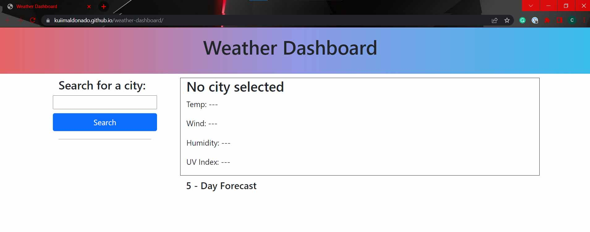
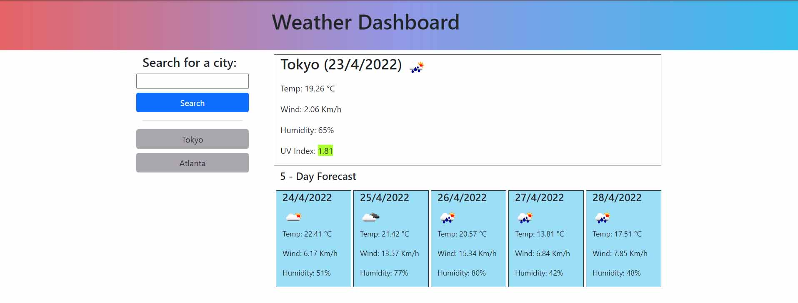
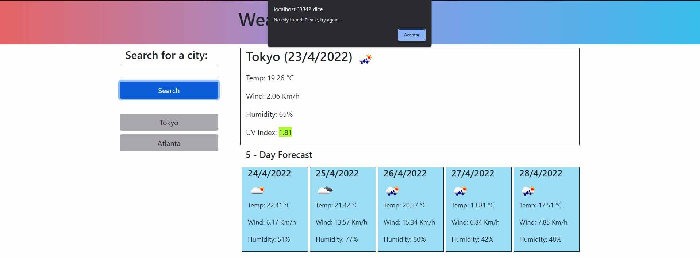
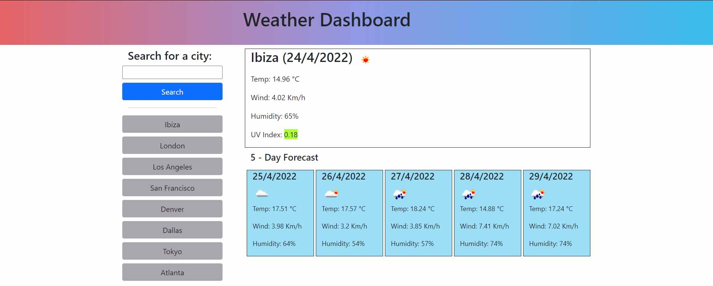

# 06 Server-Side APIs: Weather Dashboard

## Your Task

Third-party APIs allow developers to access their data and functionality by making requests with specific parameters to a URL. Developers are often tasked with retrieving data from another application's API and using it in the context of their own. Your challenge is to build a weather dashboard that will run in the browser and feature dynamically updated HTML and CSS.

Use the [OpenWeather One Call API](https://openweathermap.org/api/one-call-api) to retrieve weather data for cities. Read through the documentation for setup and usage instructions.

## User Story

```
AS A traveler
I WANT to see the weather outlook for multiple cities
SO THAT I can plan a trip accordingly
```

## Acceptance Criteria

```
GIVEN a weather dashboard with form inputs
WHEN I search for a city
THEN I am presented with current and future conditions for that city and that city is added to the search history
WHEN I view current weather conditions for that city
THEN I am presented with the city name, the date, an icon representation of weather conditions, the temperature, the humidity, the wind speed, and the UV index
WHEN I view the UV index
THEN I am presented with a color that indicates whether the conditions are favorable, moderate, or severe
WHEN I view future weather conditions for that city
THEN I am presented with a 5-day forecast that displays the date, an icon representation of weather conditions, the temperature, the wind speed, and the humidity
WHEN I click on a city in the search history
THEN I am again presented with current and future conditions for that city
```

## Deployed app

### URL: https://kuiimaldonado.github.io/weather-dashboard/

Entering for the first time to the application you will find the main screen like this:



This is because you don't have a previous search history of cities to be displayed.

Next step is to search for a desired city.
Write the name of the city in the input field and click on search. 
If a city is found the dashboard will display the city's weather information as well as a 5-day forecast.



In case the city entered is not found the web will show an alert like the one below.



Your search history will store a maximum the latest 8 cities you searched.

Cities not found won't be added to the search history.

Clicking in a search history button will get the weather of that city.

Once you have a search history this one will be saved so you don't have to worry of losing the weather data from the city you are looking at.

